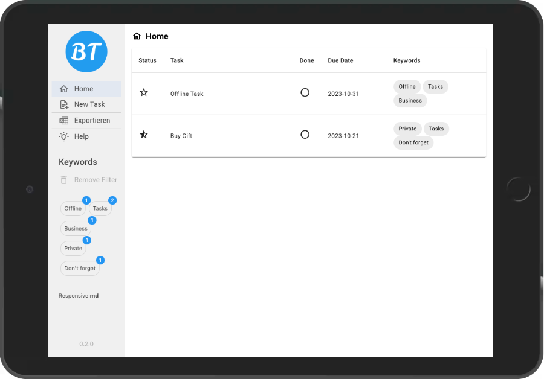

# Browser Task

> Learning React
> 
> <https://blueskyfish.github.io/browser-tasks/>

## Requirement

| Tools                                                         | Description                                      |
|---------------------------------------------------------------|--------------------------------------------------|
| [**Volta**: https://volta.sh/](https://volta.sh/)             | *The Hassle-Free JavaScript Tool Manager*        |
| [**NodeJS 20**: https://nodejs.org/en](https://nodejs.org/en) | *Run JavaScript Everywhere*                      |
| [**React 18**: https://react.dev/](https://react.dev/)        | *The library for web and native user interfaces* |


## Install

The tool volta is installed first. Then go into the project root directory and install all node dependencies.

```shell
curl https://get.volta.sh | bash
npm install
npm run
```


## Feature

* Only local storage. No data are sent to internet
* Export tasks as csv-, json- or sheet file (sheet as Excel)
* Filter the keywords


## Screenshots

### Home




### Detail


### Edit


## PWA

> Progressive Web App
> 
> * Wikipedia Deutsch <https://de.wikipedia.org/wiki/Progressive_Web_App>
> * Wikipedia English <https://en.wikipedia.org/wiki/Progressive_web_app>

The stackoverflow help me to convert into a PWA.
<https://stackoverflow.com/questions/71158834/how-to-make-an-existing-react-app-installable-pwa>

Thanks :-)

## Favicon

### Generator

This favicon was generated using the following font:

- Font Title: Leckerli One
- Font Author: Copyright (c) 2011 Gesine Todt (www.gesine-todt.de hallo@gesine-todt.de), with Reserved Font Names "Leckerli"
- Font Source: http://fonts.gstatic.com/s/leckerlione/v20/V8mCoQH8VCsNttEnxnGQ-1itLZxcBtItFw.ttf
- Font License: SIL Open Font License, 1.1 (http://scripts.sil.org/OFL))

### Maskable Favicon

Create the maskable favicon with <https://maskable.app/editor>.


## License

```text
Copyright 2023 Blueskyfish

Permission is hereby granted, free of charge, to any person obtaining a copy of this
software and associated documentation files (the “Software”), to deal in the Software
without restriction, including without limitation the rights to use, copy, modify,
merge, publish, distribute, sublicense, and/or sell copies of the Software, and to
permit persons to whom the Software is furnished to do so, subject to the following
conditions:

The above copyright notice and this permission notice shall be included in all copies
or substantial portions of the Software.

THE SOFTWARE IS PROVIDED “AS IS”, WITHOUT WARRANTY OF ANY KIND, EXPRESS OR IMPLIED,
INCLUDING BUT NOT LIMITED TO THE WARRANTIES OF MERCHANTABILITY, FITNESS FOR A
PARTICULAR PURPOSE AND NONINFRINGEMENT. IN NO EVENT SHALL THE AUTHORS OR COPYRIGHT
HOLDERS BE LIABLE FOR ANY CLAIM, DAMAGES OR OTHER LIABILITY, WHETHER IN AN ACTION OF
CONTRACT, TORT OR OTHERWISE, ARISING FROM, OUT OF OR IN CONNECTION WITH THE SOFTWARE
OR THE USE OR OTHER DEALINGS IN THE SOFTWARE.
```
